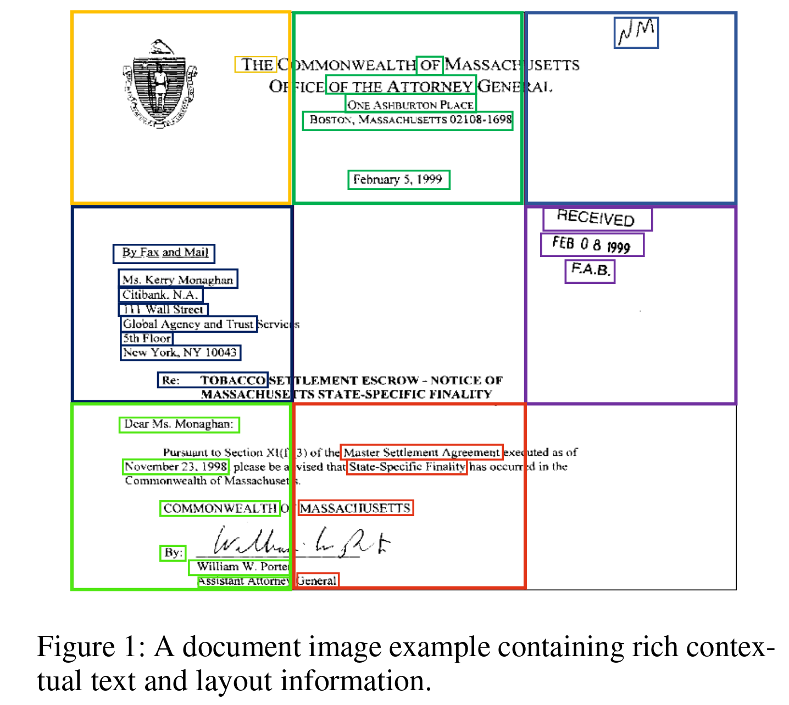
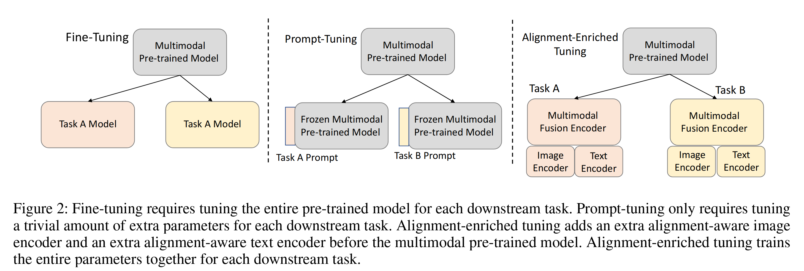
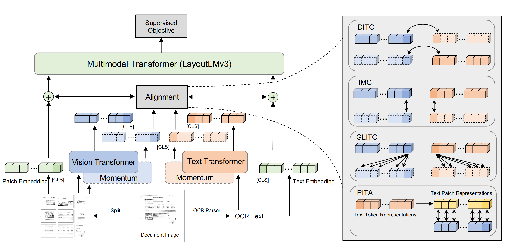
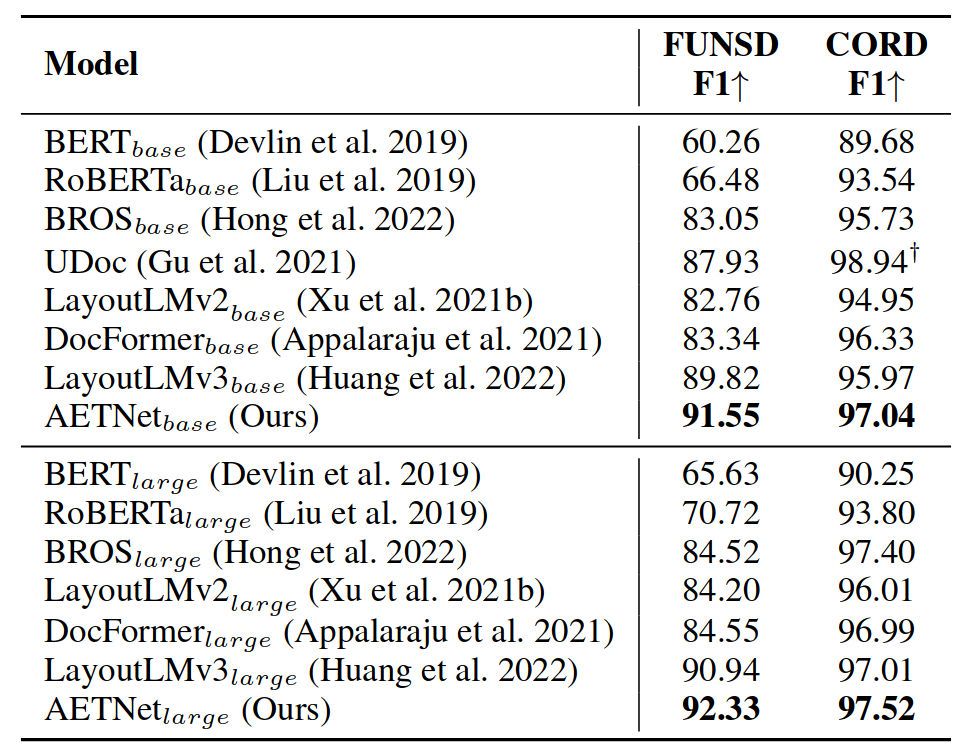

# Alignment-Enriched Tuning for Patch-Level Pre-trained Document Image Models

## 一 背景

如下图，包含了丰富上下文信息和结构信息， 需要对图像和文本进行细粒度的交互建模。但是现有的预训练文档图像模型大多采用粗粒度的自监督损失进行训练，忽略了图像与文本之间的细粒度交互建模。

DocFormer 采用通过 CNN decoder 重建图像像素
SelfDoc 提出对 mask 区域特征进行回归 
LayoutLMv3 通过重建视觉模态的 makked patch token，引入 word-patch 对齐目标。 
patch 级别的预训练表现的很有前景，然而在预训练过程中，研究出更有效或更细粒度的对齐技术需要大量的计算成本和时间。 
本文提出的问题，能否微调一个预训练模型，使其适应具有对齐目标的下游任务，并达到更好的性能。 

由于预训练模型的固定架构，将对齐损失纳入现有的微调方法是不方便的，如下图：

Fine-Tuning 对每个预训练任务需要微调所有参数; 
Prompt-Tuning 只需要微调少量的额外参数； 
Alignment-enriched Tuning 是本文提出的微调方式，添加了额外的 alignment-aware encoder 和 alignment-aware text encoder，需要微调所有参数。

## 二 方法

AETNet(**A**lignment-**E**nriched **T**uning **N**et)  
### 2.1 结构

输入的文档图像 $I$ 首先被 encoder 为一系列的 patch-level 视觉特征向量，通过 Vit 获得 $\{v_{cls}, v_1,...v_N\}$，$N$ 是 patch 的数量; 
输入的文本由开源 OCR 工具 Tesseract 获得，结果喂入 Roberta，转化为文本 token 表征向量，$\{w_{cls},w_1,...,w_L\}$，$L$ 是文本 token 的长度; 
在与 LayoutLMv3 融合之前，我们根据获得的关于 alignment-aware 目标的表示计算 alignment-aware 损失，让获得的表征保留对齐信息。然后通过 alignment-enriched 图像表征向量和 LayoutLMv3 的原始输入图像迁入的总和推导出 LayoutLMv3 的 patch-level 输入图像嵌入。同样的，LayoutLMv3 的输入文本向量由获得的对齐增强文本表征向量和 LayoutLMv3 的原始输入文本向量之和到处，最后，LayoutLMv3 将新的融合嵌入转化为输入隐藏表示，用于计算有监督的特定任务损失。 

### 2.2 微调目标
 包含五个目标： 

**下游任务的主观目标 subjective objective(SO) 
全局跨模态对齐 global-level cross-modal alignment (GCMA) 
全局内部模态对比 global-level intra-modal contrastive (GIMC)  
全局局部 MI 最大化 Global-Local MI Maximization(GLMI)  
局部跨模态对齐 Local-level Cross-Modal Alignment (LLCMA) **
$$
\mathcal{L}_{aet}=\mathcal{L}_{so} +\mathcal{L}_{ditc} +\mathcal{L}_{imc} +\mathcal{L}_{glitc} +\mathcal{L} _{pita}
$$
**SO**  
以 token labeling 为例，$L_{so}$ token 的预测和ground-truth 的交叉损失。 

**DITC**  
目的是更好的学习 文档级别也就是全局级别的阔模态对齐。将匹配的文本图像拉近，将不匹配的文本图像拉远 
为了建模全局信息，本文使用相似性函数：
$$
sim(v_cls,\widetilde{w}_{cls}) = f_{img}(v_{cls})^{\top}f_{text}(\widetilde{w}_{cls})\\
和\\
sim(w_cls,\widetilde{v}_{cls}) = f_{text}(v_{cls})^{\top}f_{img}(\widetilde{v}_{cls})
$$
其中 $f_{img}$ 和 $f_{text}$ 是用于将隐藏向量映射到对比损失空间中的地位表表征的两个投影头，$v_{cls}$ 和 $w_{cls}$ 分别是来自对齐感知图像和文本编码器的两个 [CLS] 向量。 
维护两个内存队列
$$
image: \widetilde{I}_{cls}=\{ \widetilde{v}_{cls}^1,..., \widetilde{v}_{cls}^K\}\\
和\\
text:  \widetilde{T}_{cls}=\{ \widetilde{w}_{cls}^1,..., \widetilde{w}_{cls}^K\}
$$
这两个队列用来记录来自 momentum alignment-aware encoders 中最常见的 K image 和 文本表征。 
对文档图像 I 和 OCR 文本 T 的文档级别对比损失可以定义如下：
$$
\mathcal{L}_{c l}\left(v_{c l s}, \tilde{w}_{c l s}, \tilde{T}_{c l s}\right)=-\log \frac{\exp \left(\operatorname{sim}\left(v_{c l s}, \tilde{w}_{c l s}\right) / \tau\right)}{\sum_{k=1}^{K} \exp \left(\operatorname{sim}\left(v_{c l s}, \tilde{w}_{c l s}^{k}\right) / \tau\right)}
$$
其中 $\tau$ 是 learnable temperature rate，考虑到图像到文本和文本到图像一起，DITC loss 被定义为：
$$
\mathcal{L}_{\text {ditc }}=\frac{1}{2} \mathbb{E}_{(I, T) \sim B}\left[\mathcal{L}_{c l}(v_{c l s}, \tilde{w}_{c l s}, \tilde{T}_{c l s})+\mathcal{L}_{c l} (w_{c l s}, \tilde{v}_{c l s}, tilde{I}_{c l s})\right]
$$

$B$ 是一批图像文本对，按照 ALBEF，通过动量模型产生的为目标来指导 DITC 损失的训练。

**IMC**
为了在单一模态中学习更多准确的模态。 
对于视觉模态，通过喂进到动量对准感知图像编码器中，为锚点增强图像 $I^+$ 生成潜在的图像表征，$\{ v_{cls}^+,v_{1}^+,...,v_{N}^+ \}$
 
对于文本模态，生成潜在文本表征，$\{ w_{cls}^+,w_{1}^+,...,w_{L}^+ \}$

用于 DITC 的两个动量队列也为 IMC 损失提供了负样本，IMC 损失定义如下：
$$
\mathcal{L}_{\text {imc }}=\frac{1}{2} \mathbb{E}_{(I, T) \sim B}\left[\mathcal{L}_{c l}(v_{c l s}, {v}_{c l s}^+, \tilde{I}_{c l s})+\mathcal{L}_{c l} (w_{c l s}, {w}_{c l s}^+, \tilde{T}_{c l s})\right]
$$

**GLITC**  
通过建模文档级表征和局部区域之间的相互作用来获得单个模态内的局部和结构信息。 
对于视觉模态，使用全局表征 $v_{vls}$，并计算与动量图像块表征 $\{\widetilde{v}_2, ..., \widetilde{v}_N\}$ 的对比损失。 
对于文本模态，使用 token [CLS] 表示 $w_{cls}$，使用动量文本 token 表征 $\{\widetilde{w}_2, ..., \widetilde{w}_L\}$ 计算损失。 
本文鼓励通过最小化下面的双边交互对比损失来建模同一模态下全局信息和局部信息之间的交互：
$$
\mathcal{L}_{\text {imc }}=\frac{1}{2} \mathbb{E}_{(I, T) \sim B}\left[\frac{1}{N}\sum_{i=1}^N \mathcal{L}_{c l}(v_{c l s}, {v}_{c l s}^+, {I}_{B}^-)+\frac{1}{L}\sum_{j=1}^L\mathcal{L}_{c l} (w_{c l s}, {w}_{c l s}^+, {T}_{B}^-)\right]
$$
${I}_{B}^-$ 和 ${T}_{B}^-$ 是负图像 patch 和文本 token 的表征向量，这些负样本来自于同 batch B 中的其他数据实例。

**PITA**  
片级对齐对于学习**更精确、更细粒度**的表示以获得更准确的文档理解至关重要。因此，我们提出了一种新的 patch 级别对齐损失，作为前三种对比损失的补充。为了计算块级别的对齐损失，我们首先通过一种基于规则的策略找到匹配图像块的文本 tokens，该策略通过从OCR工具包中获得的布局信息来定位图像块中的文本。然后，我们对匹配文本 tokens 的表征向量进行平均，从而得到匹配文本 $\{t_1,t_2,...t_N \}$ 的 patch 级文本表征。下面定义PITA损失：
$$
\mathcal{L}_{pita}=-\frac{1}{N}(\sum_{i=1}^N\frac{<v_i,t_i>}{||v_i||·||t_i||})
$$

## 三 实验
主体 LayoutLMv3，文本视觉：RoBERTa 和 Deit

**总结** 
本文提出了一种新的模型架构和对齐增强调优方法，命名为AETNet，用于迁移文档图像中的多模态预训练模型。AETNet由一个额外的视觉转换器作为对齐器图像编码器和一个额外的文本转换器作为对齐器文本编码器，以及一个由预训练的模型参数初始化的多模态融合编码器组成。基于该模型架构，AETNet通过联合任务特定的监督和对齐感知的对比目标，为下游任务调优预训练模型。AETNet在不同的下游任务上通过微调和不同的常用调优技术实现了对现有最先进的预训练模型的一致改进，这表明了提出的AETNet的有效性。