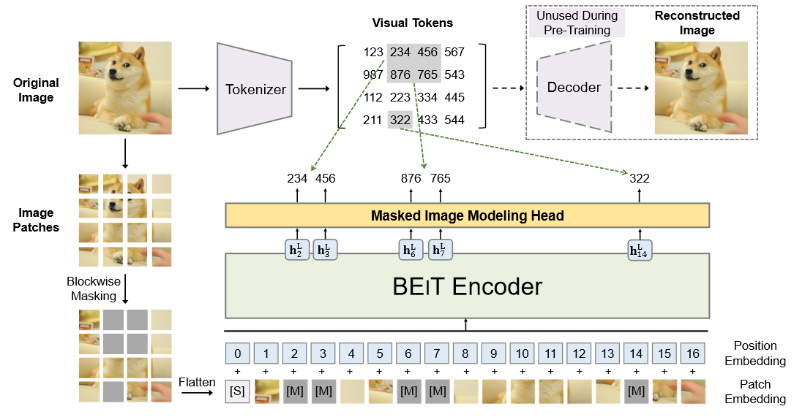

# BEITS

## 1 背景

transformer 在计算机视觉取得了很大的成就，根据经验来说，transformer 需要更大的数据量，为了解决数据量不足的问题，自监督预训练是一个有希望的方法。

BERT 在 NLP 领域的预训练取得了很大的成功，其中的 MLM 预训练任务被证明有效。受到此启发，将其推广到计算机视觉的与训练中，但是遇到了很多问题。

1. NLP 任务中，存在一个预先的词典，而在图像中，没有这样的词典
2. 

## 2 BEITS: BERT Pre-Training of Image Transformers

### 2.1 简介

提出 MIM（masked image model）预训练任务，

### 2.2 模型

**B**idirectional **E**ncoder representation from **I**mage **T**ransformers

#### 2.2.1 图像表示

给定一个图像 $x$，BEiT 有两种表示方式，*image patch* 和 *visual token* 

==image patch==

同 ViT

1. 首先将原始图片 resize 为 $H\times W$，即 图片 $x\in \mathbb{R}^{H\times W\times C}$ ，指数分别是 高 宽 通道数，（实验中 $H=W=224,\ C=3$ ）
2. 将原图片切分为若干个 patches，每个 patch 的尺寸为 $P\times P$，（实验中 $P=16$，因此有 $(224\times 224) / (16\times 16)=196$ 个 patches）
3. 那么图片将被切分为 $N$ 个，$N=HW/P^2$，原图片变为 $x_p=\mathbb{R}^{N\times (P^2\cdot C)}$，$N$ 也是输入 有效的输入 transformer 的序列的长度，（实验中，$N=196$  ）
4. Linear Projection of Flattened Patches，将 patches 摊平，然后进行线性投影，映射为一个 $D$ 维向量，也就是将 patch 拉直，尺寸为 $1\times 1 \times D$，长度为 D，本文称为 **patch embedding**，对应公式如下。(实验中，$D=P\times P \times C=16*16*3=768$)

==visual token==

使用 **tokenizer** 将图片分词

1. 图片 $x\in \mathbb{R}^{H\times W\times C}$ tokenize 到 $\mathbf{z}=[z_1,...,z_N]\in \mathcal{V}^{h\times w}$， $\mathcal{V}=\{1,...|\mathcal{V}|\}$包含了离散的 token 索引
2. 使用 **dVAE** ，将一块 patch 映射到一个 token z，模型基于 z 可以重建这个 patch。这个过程成为 图片的 tokenize，使用的是 `DALL-E` 的 image tokenizer。本文将图片 分为 14×14 个 patches，也就是对应 196 个 tokens，实验中，$|\mathcal{V}|=8192$ 

#### 2.2.2 模型主干

Image Transformer，同 VIT

输入是 patches 的序列：$\{x_i^p\}_{i=1}^N$，然后 patches 被线性映射到 patch embeddings $\mathbf{E}x_i^p$，$E\in \mathbb{R}^{(P^2C)\times D}$，

添加特殊 token [S]，和 1D position embedding $\boldsymbol{E}_{pos}$，$\boldsymbol{E}\in \mathbb{R}^{N\times D}$ 

最终输入为 $\boldsymbol{H}_{0}=\left[e_{[\mathrm{S}]}, \boldsymbol{E} \boldsymbol{x}_{i}^{p}, \ldots, \boldsymbol{E} \boldsymbol{x}_{N}^{p}\right]+\boldsymbol{E}_{p o s}$   

### 2.3 预训练任务

Masked Image Modeling

随机 mask 一定比例的 image patches，（40%），然后去预测对应 这些 patches 的 visual tokens

被 mask 的位置被表示为 $\mathcal{M}\in \{1,...,N\}^{0.4N}$，用可学习的 embedding $e_{[M]} \in \mathbb{R}^D$

被破坏的 image patches $x^{\mathcal{M}}=\{x_i^p:i\notin \mathcal{M}\}_{i=1}^N \cup\{ e_{[M]}:i\in \mathcal{M} \}_{i=1}^N$ ，将其喂进 transformer，

最终的隐藏向量 $\{h_i^L\}_{i=1}^N$ 被当做是输入 patches 的 encoded representations。对每一个 被 mask 的位置，使用 softmax classifier 去预测对应的 visual tokens，

$p_{\mathbf{MIM}}(z'|x^{\mathcal{M}})=\text{softmax}_{z'}(\mathbf{W}_c\mathbf{h}_i^L+\mathbf{b}_c)$ 

预训练目标是最大化 得到正确 visual token $z_i$ 的最大 **log似然估计** 
$$
\max \sum_{x \in \mathcal{D}} \mathbb{E}_{\mathcal{M}}\left[\sum_{i \in \mathcal{M}} \log p_{\text {MIM }}\left(z_{i} \mid x^{\mathcal{M}}\right)\right]
$$

