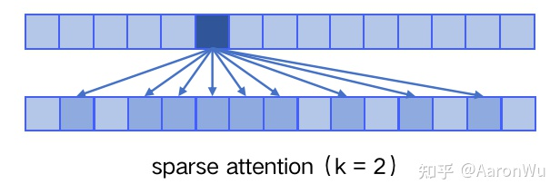

# GPTs

## 1 GPT1

Improving Language Understanding by Generative Pre-Training

### 1 背景

NLP 对依赖于监督学习，这需要大量人工标注数据，限制了 NLP 模型在缺乏标注的领域的适用性。在这种情况下，模型要是能够利用未标注的数据就好了。此外，即使在监督学习的情况下，无监督也能够提供显著的性能提升，例如分词，此 embedding等。

**难点** 

1. 没有一个优化目标，无法计算损失
2. 用未标注的数据训练后，不知道如何将学习到的迁移到目标任务

 

### 2 模型

#### 2.1 自监督预训练 

给定一个 无监督的 tokens 语料库 $\mathcal{U}=\{u_1,u_2,...,u_n  \}$，
$$
L_{1}(\mathcal{U})=\sum_{i} \log P\left(u_{i} \mid u_{i-k}, \ldots, u_{i-1} ; \Theta\right)
$$
$k$ 是 文本窗口，$P$ 是参数为 $\Theta$  的概率分布，这两个都是可训练参数。

然后使用 多层 transformer 的 decoder：
$$
\begin{aligned}
h_{0} & =U W_{e}+W_{p} \\
h_{l} & =\operatorname{transformer} b \operatorname{block}\left(h_{l-1}\right) \forall i \in[1, n] \\
P(u) & =\operatorname{softmax}\left(h_{n} W_{e}^{T}\right)
\end{aligned}
$$
$U=(u_{-k}, ...,u_{-1})$ 是 tokens 的向量，$n$ 是 decoder 的层数，$W_e$ 是 token embedding 矩阵, $W_p$ 是position embedding矩阵

#### 2.2 有监督微调 

数据集为 $\mathcal{C}$，每个实例包含一个 token 序列 $x^1,x^2,...,x^m$，label 为 $y$，transformer decoder最后的激活层为 $h_l^m$，然后喂进线性输出层 $W_y$ 去预测 $y$： 
$$
P\left(y \mid x^{1}, \ldots, x^{m}\right)=\operatorname{softmax}\left(h_{l}^{m} W_{y}\right)
$$
最大化目标为：
$$
L_{2}(\mathcal{C})=\sum_{(x, y)} \log P\left(y \mid x^{1}, \ldots, x^{m}\right)
$$
实验发现，加入语言模型学习目标作为辅助任务，能够：1.提升监督模型的泛化能力；2.加快收敛。总的最大化目标为：
$$
L_{3}(\mathcal{C})=L_{2}(\mathcal{C})+\lambda*L_{1}(\mathcal{C})
$$
因此只需要微调 $W_y$ 和特殊 Token

### 3 微调任务

实验

7000本未发表的书

## 2 GPT2

Language Models are Unsupervised Multitask Learners

**GPT1 和 GPT2 的区别可以概括为：** 

最大的区别，GPT2 没有微调。

从数据量上，GPT 使用了约 5GB 数据，而 GPT2 利用了 40GB，并且质量更高；

从模型的规模和参数量上说，GPT 有 1.17 亿的参数量，而 GPT2 使用了更深的网络结构，更高的隐藏层维度，参数量达到了15亿；

模型结构方面，GPT2 的结构类似于GPT，仍然使用单向的 Transformer 模型，只做了一些局部修改：将 layer normalization 放到每个 sub-block前，并在最后一个 self-attention 后再增加一个 layer normalization；

训练任务方面，GPT2 放弃了 GPT 第二阶段的有监督训练，完全使用无监督任务进行语言模型训练。完全不需要去定义这个模型应该做什么任务，因为很多标签所蕴含的信息，就存在于语料当中。

此外，GPT2 将词汇量数量增加到 50257 个，最大的上下文从 GPT1 的 512 提升到了 1024 个 tokens，batchsize 增加到 512。

## 3 GPT3

最近的研究表明，在 pretrain+finetune 模型中，当模型适应了下游任务的训练集后，往往会失去对下游任务的 OOD（out-of-distribution）泛化能力，这种能力也被称为Zero-shot能力，由于训练集不可能涵盖整个真实分布，而且预测数据的分布也随时间变化而变化，因此模型需要具备 OOD 的能力。通过构建 OOD 测试集，并与 IID（Independent Identically Distribution 指训练集和测试集是同分布但是互相独立）上的表现进行比较，进行了一些实验研究：
1. 传统 NN 衰减很大，甚至只有 30%，而 PTM 衰减很小；
2. 更大 size 的 PTM，并不一定表现更好；
3. PTM 使用的训练数据的规模越大、多样性越强，表现越好，这点在ChatGPT的训练集构建中也体现出来了。

引入 sparse attention 模块，sparse attention：每个 token 只与其他 token 的一个子集计算 attention，复杂度 O(n*logn)。具体来说，sparse attention 除了相对距离不超过 k 以及相对距离为 k，2k，3k，... 的 token，其他所有 token 的注意力都设为 0，如下图所示：

使用 sparse attention 的好处主要有以下两点：

1. 减少注意力层的计算复杂度，节约显存和耗时，从而能够处理更长的输入序列；
2. 具有“局部紧密相关和远程稀疏相关”的特性，对于距离较近的上下文关注更多，对于距离较远的上下文关注较少；

